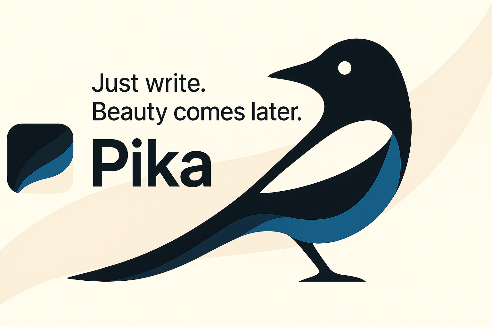
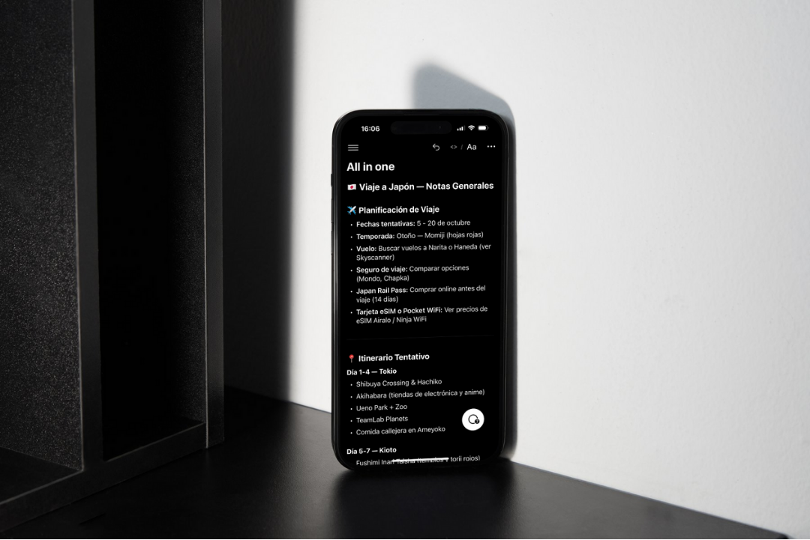
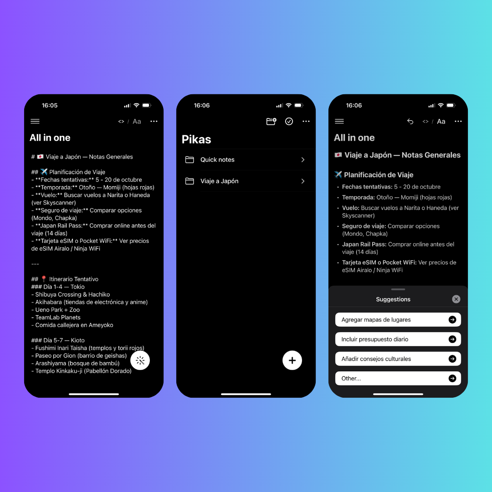
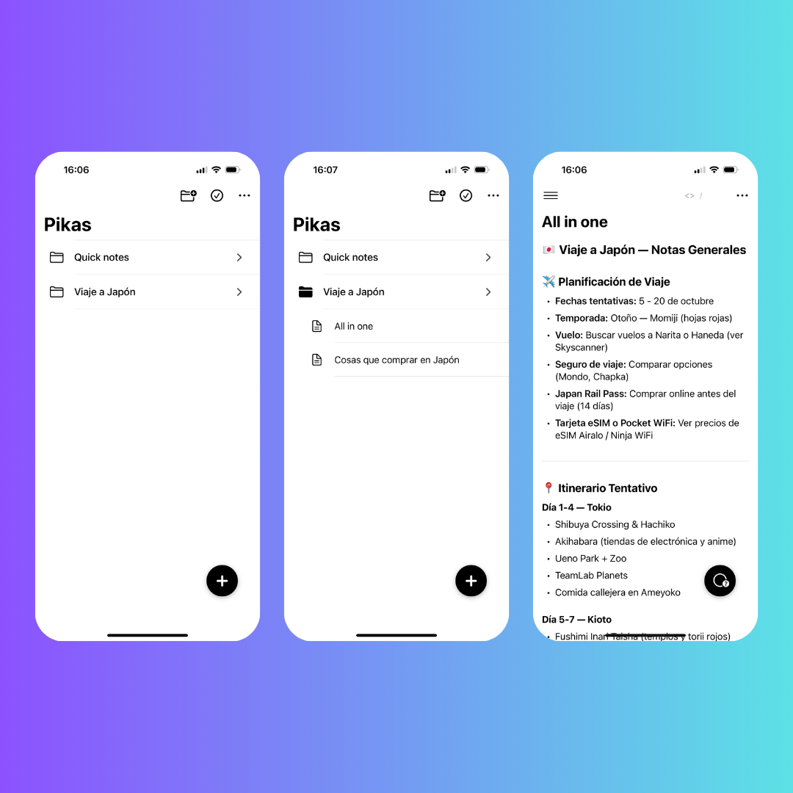

<p align="center">
  
</p>

# 📝 Pika – Capture Now, Enhance Later

<p align="center">
  
</p>

<p align="center">
  <a href="https://www.buymeacoffee.com/tofusito"></a>
  
  
  
</p>

**A minimalist note-taking app where ideas flow freely, then transform beautifully with AI.**  
Pika your thoughts. Let AI enhance them. Create stunning notes effortlessly.

---

## 📑 Table of Contents

- [✨ What is Pika?](#-what-is-pika)
- [🧠 What Can Pika Do?](#-what-can-pika-do)
- [☕ Support Pika's Development](#-support-pikas-development)
- [🛠️ Tech Stack & Architecture](#️-tech-stack--architecture)
- [💡 Smart Features](#-smart-features)
- [🚀 Getting Started](#-getting-started)
- [📁 Project Structure](#-project-structure)
- [💭 Philosophy](#-philosophy)
- [🛣️ What's Next?](#️-whats-next)
- [🤝 Contributing](#-contributing)
- [📝 License and Legal](#-license-and-legal)

---

## ✨ What is Pika?

**Pika** is not just another note-taking app.  
It's your thoughtful companion that understands that capturing ideas quickly is often more important than formatting them perfectly at first.

Inspired by the creative process itself, where brilliant ideas need to be captured immediately before they vanish, Pika provides a frictionless space to pour out your thoughts. Then, with the power of AI, it helps transform your raw ideas into beautifully structured notes, suggestions, and insights.

---

## 🧠 What Can Pika Do?

- 📝 Quickly capture your thoughts without thinking about format or structure  
- ✨ Transform raw notes into well-structured markdown with a single tap  
- 💡 Get intelligent suggestions to improve, expand, and enhance your notes  
- 🗂️ Organize notes in a simple folder structure with a clean, distraction-free interface  
- 🔄 View changes between your original thoughts and AI enhancements  
- 🔄 Undo AI transformations if you prefer your original wording  
- 📱 Enjoy a beautiful experience designed specifically for iOS  
- 🌗 Work comfortably with dark and light mode support

<p align="center">
  <!-- App screenshot - Replace with actual screenshot -->
  
  <!-- You'll need to create screenshots of your app and place them in Resources/Screenshots/ -->
</p>

---

## ☕ Support Pika's Development

Currently, Pika is a passion project that I'm developing in my spare time.

With your support, I can dedicate more time to adding new features, refining the UI, and making Pika even better at helping you capture and enhance your ideas.

If you find Pika useful or promising, consider supporting its development:

### 👉 [Buy me a coffee to fuel Pika's development](https://www.buymeacoffee.com/tofusito)

<p align="center">
  <a href="https://www.buymeacoffee.com/tofusito">
    
  </a>
</p>

**Your support helps me:**
- 🚀 Add more advanced AI capabilities  
- 🧪 Refine and polish the user experience  
- 🌈 Add new transformation options  
- 🔁 Implement cross-device synchronization  
- 🧠 Feed the developer (me) so I can keep improving Pika

---

## 🛠️ Tech Stack & Architecture

### 🔧 Core Technologies

- Swift & SwiftUI – for beautiful, native UI  
- Files app integration – for storing your notes  
- Markdown – for beautiful formatting  
- OpenAI API – for intelligent transformations and suggestions

### 📂 Note Structure

Each note in Pika is stored as a simple markdown file, making it easily accessible from other apps:

```
Notes/
├── Project Ideas/
│   ├── New App Concept.md
│   └── Marketing Plan.md
└── Journal/
    ├── Today's Reflections.md
    └── Weekly Goals.md
```

### 🧩 MVVM Architecture

- `Item`: Models for folders and notes  
- `FloatingButtonStore`: Manages context-aware floating action button  
- `TextDiffStore`: Handles comparing original and transformed text  
- `SuggestionStore`: Manages AI-generated suggestions  
- `OpenAIService`: Interacts with OpenAI for text transformations

---

## 💡 Smart Features

### ✨ AI Transformations

Transform your notes with different AI modes:
- Structuring messy notes  
- Completing partial thoughts  
- Expanding on brief ideas  
- Enhancing writing style  
- Generating insights from your notes

### 💎 Contextual Suggestions

Pika doesn't just transform your text; it provides helpful suggestions:
- Related topics to explore  
- Questions to consider  
- Additional sections to add  
- Research points to investigate

### 🌟 Beautiful Markdown Rendering

- Headings, lists, code blocks  
- Tables and blockquotes  
- Links with proper formatting  
- Task lists with interactive checkboxes

<p align="center">
  <!-- Feature showcase - Replace with actual screenshots -->
  
  <!-- A collage of screenshots showing different features in action would be great here -->
</p>

<p align="center">
  <!-- Feature showcase - Replace with actual screenshots -->
  
  <!-- A collage of screenshots showing different features in action would be great here -->
</p>

---

## 🚀 Getting Started

1. Clone the repo
   ```bash
   git clone https://github.com/yourusername/pika.git
   cd pika
   ```

2. Open the project in Xcode
   ```bash
   open Pika.xcodeproj
   ```

3. OpenAI API Configuration
   - You'll need to provide your own OpenAI API key
   - Add it in the app settings
   - API keys are securely stored in the device's keychain

4. Build and run the project (⌘+R)

---

## 📁 Project Structure

This project follows a clean architecture to keep code organized:

```
Pika/
├── Sources/
│   ├── App/              # App entry point
│   ├── Models/           # Data models
│   ├── Views/            # SwiftUI views
│   │   ├── Root/         # Main navigation views
│   │   ├── Notes/        # Note editing views
│   │   ├── Components/   # Reusable UI components
│   │   ├── Settings/     # Settings views
│   │   └── Info/         # App info screens
│   ├── Services/         # Services (OpenAI, etc.)
│   └── Utils/            # Utilities and helpers
├── Assets.xcassets/      # App assets
├── Info.plist            # App configuration
└── Pika.entitlements     # App entitlements
```

---

## 💭 Philosophy

Pika was created with a simple philosophy in mind:

> **The greatest barrier to capturing ideas is the pressure to perfect them immediately.**

We believe:

1. **Capture without friction** - When inspiration strikes, you should be able to pika your thoughts without thinking about structure or format
2. **Enhance with intelligence** - AI can help transform raw thoughts into structured content after they're safely captured
3. **Keep it simple** - Note-taking shouldn't require learning complex systems or shortcuts

This philosophy guides every feature and design decision in Pika.

---

## 🛣️ What's Next?

- 📊 Export options (PDF, HTML)  
- 🔍 Advanced search capabilities  
- 🔄 iCloud sync across all devices  
- 👥 Collaboration features  
- 🧩 Templates for different note types  
- 🎙️ Voice note capabilities  
- ⚙️ More customization options

---

## 🤝 Contributing

Contributions are welcome! Please check out our [Contributing Guidelines](CONTRIBUTING.md) for more details on how to participate in this project.

---

## 📝 License and Legal

**IMPORTANT LEGAL NOTICE:**

Pika is released under a proprietary license that provides specific rights while reserving others. By accessing, forking, cloning, or using this repository in any way, you agree to comply with the terms set forth in our legal documentation.

Key legal points:
- ✅ Personal Use: You may download, compile, and use the app on your personal devices
- ✅ Code Contributions: You may submit contributions under our [contribution guidelines](CONTRIBUTING.md)
- ✅ Educational Use: You may use the code for learning and teaching purposes
- ❌ Commercial Use: Commercial usage requires explicit written permission
- ❌ App Store Publishing: Publishing to any app store is strictly prohibited without authorization
- ❌ Trademark Usage: The Pika name and logo cannot be used without permission

**Legal Documentation:**
- [LICENSE](LICENSE) - Complete proprietary license terms
- [COPYRIGHT.md](COPYRIGHT.md) - Copyright and intellectual property notices
- [CONTRIBUTING.md](CONTRIBUTING.md) - Contribution terms and requirements
- [SECURITY.md](SECURITY.md) - Security vulnerability reporting procedures

Unauthorized use may result in legal action. See the [LICENSE](LICENSE) file for complete terms.

---

**Made with ❤️ and ☕ by [Manuel Gutiérrez](https://www.buymeacoffee.com/tofusito)**

<p align="center">
  <!-- Final app screenshot or logo - Replace with actual image -->
  
  <!-- A nice closing screenshot would be great here -->
</p> 